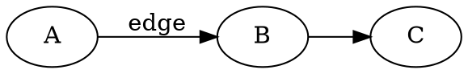

# Introduction

This document exercises the quill toolchain end-to-end: headings, prose, inline `code`, fenced code blocks, math, lists, tables, and a footnote.[^1] If any of these render badly, the smoke test catches it.

# Prose and emphasis

quill renders *italic*, **bold**, and ***bold-italic*** prose. Quotation marks should be "curly" with `--smart` (pandoc's default) — never `"straight"`.

# Math

Inline math like $e^{i\pi} + 1 = 0$ should render via xelatex, as should display math:

$$
\nabla \cdot \mathbf{E} = \frac{\rho}{\varepsilon_0}
$$

# Code

```python
def render(markdown: str) -> bytes:
    """Render markdown to PDF via quill."""
    return subprocess.check_output(["quill", "--to=pdf"], input=markdown.encode())
```

# A list

- First item
- Second item with a longer description that spills onto multiple lines so we can verify line wrapping and leading
- Third item

# A table

| Defaults key | Type | Value |
|---|---|---|
| `pdf-engine` | string | `xelatex` |
| `fontsize` | string | `11pt` |
| `linestretch` | number | `1.15` |
| `linkcolor` | LaTeX colour | `RoyalBlue` |

# A diagram

This fenced `dot` block is rewritten to a TikZ figure by the bundled `dot2tikz.lua` filter. If quill is rendering correctly, the block below appears as a styled directed graph in the PDF — not as code.



[^1]: Footnotes should render as numbered marginal notes.
